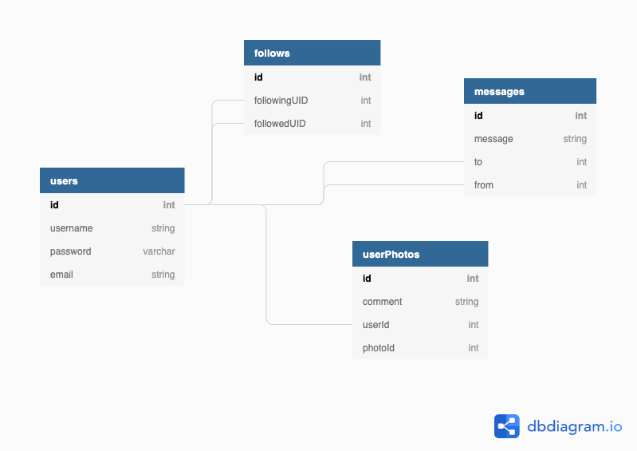

# Curiositan 

[Kirk Sudduth](https://github.com/kirksudduth)'s Front-End Capstone for [Nashville Software School Cohort 40](https://github.com/nss-cohort-40)

## Proposal

People on Earth want to see what Mars looks like. The Curiosity Mars rover is taking pictures for the world to see. Users can login to Curiositan and search for pictures by date and camera used. Users can add and delete photos as well as edit comments they have made on photos.

## Project Definition

- Built with React
- Users can create accout, login via sessionStorage and logout
- Users can create, update (comment) and delete photo objects

## Setup

## Overview

This app is for organizing and collecting pictures that have been taken by the Mars Rover, Curiosity. When a user logs in they are taken directly to the PhotoSearchForm component. They can either search Curiosity's photos or go to their Saved Photos and edit comments or delete the photo all together. In the user's saved photos component, the initial render is all saved photos with the most recently added being the first of the group. Users can filter their photos by selecting a tab to look at photos by camera type or by date of the photo taken (descending latest to earliest).

**Do not login with any sensitive information. This is not a secure application.**

## Technologies Used

- This project was bootstrapped with [Create React App](https://reactjs.org/docs/create-a-new-react-app.html#create-react-app)
- [Semantic UI](https://react.semantic-ui.com/) for cards, modals, popups, forms, buttons, icons
- [React Router](https://reactrouter.com/web/guides/quick-start) for withRouter, NavLink and Route
- [Curiosity Photos API](https://github.com/chrisccerami/mars-photo-api) for getting all those wonderful Mars pics!
- [Coolors](https://coolors.co/) for picking colors

## Skills Utilized

I utilized all skills that I have learned at NSS up to this point, including:

1. React: hooks, props, state, routes
2. API call methods: PUT, POST, DELETE and GET (with \_embed)
3. Interacting and familiarizing myself with an external API
4. Javascript: objects, arrays, functions, array methods (map, reverse)
5. Data storage in json-server
6. Google
7. Modular Code

## Database Diagram

> This ERD contains my stretch goal data relationships (i.e. messages and follows) which will be included in V2.
